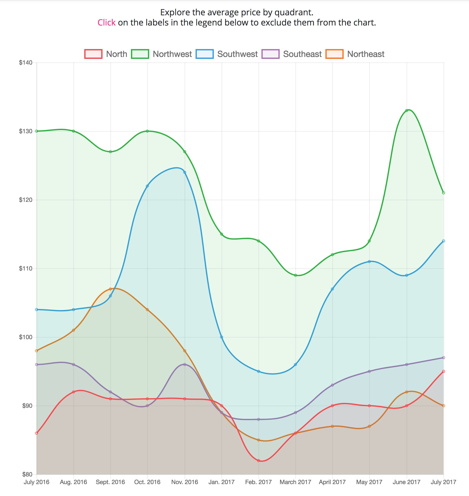
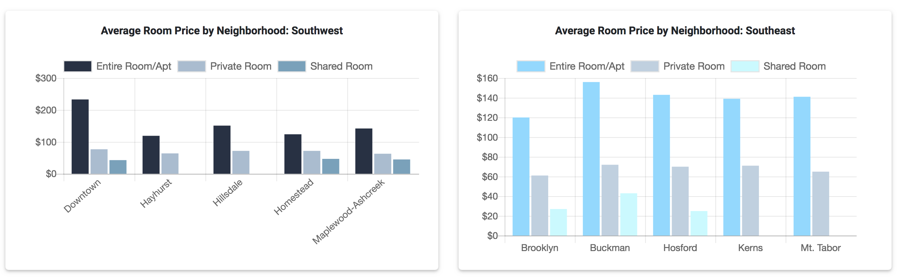

# PDXbnb

#### _By Kaila Goff, Maggie Summers, Hannah Lee & Stephanie Faber_

## Description

_A website using data visualization to help users plan their trip to Portland or decide how much to list their property on Airbnb._

_This was the result of our group project for week 5 of Epicodus' Javascript course. It was generated with [Angular CLI](https://github.com/angular/angular-cli) version 1.6.5._

_Check it out here:_ https://pdxbnb-76f3c.firebaseapp.com

<kbd></kbd>

##  Summary of High-Level Data
  * Average overall price by quadrant (North, Northwest, Southwest, Southeast, Northeast)
  * Average room price by room type
  * Average room price by quadrant broken out by entire room/apt, private room and shared room
  * Search rooms by budget and month

  <kbd></kbd>

  <kbd></kbd>

##  Current Features
  * Firebase database using scrapped data from Airbnb curated by Tom Slee. Find all the data here: http://tomslee.net/airbnb-data.
  * User authentication
  * Routing for all current pages
  * Deployed to Firebase

## Installation

  1. _`$ git clone https://github.com/kailagoff/PDXbnb` _

  2. _`$ cd PDXbnb`_

  3.  _`$ npm install`_

  4. _Add Firebase API Key (see next section)_

  5. _`$ ng serve --open`_

## Firebase Setup

  This app requires the use a Firebase API key to access Firebase database features.
  You can acquire one of your own to use when running this project by visiting the [Firebase Website](https://firebase.google.com).

  * Create a new project.

  * Import `master-pdx-airbnb-data.json` into the database of the new project.

  * Once the data is uploaded, click the gear icon next to Project Overview to access your project settings.

  * Click the button that says "Add Firebase to your web app" and copy the information from the modal window that pops up.

  * Create a file called `api-keys.ts` in the `src/app/` directory and add the following code with your API key information in place of the 'xxx's:

  ```
  export var masterFirebaseConfig = {
    apiKey: "xxxx",
    authDomain: "xxxx.firebaseapp.com",
    databaseUrl: "https://xxx.firebaseio.com",
    storageBucket: "xxxx.appspot.com",
    messageingSenderId: "xxxx"
  };
  ```

#### Development server

Run `ng serve` for a dev server. Navigate to `http://localhost:4200/`. The app will automatically reload if you change any of the source files.

#### Further help

To get more help on the Angular CLI use `ng help` or go check out the [Angular CLI README](https://github.com/angular/angular-cli/blob/master/README.md).

## Known Bugs

_No known bugs at this time._

## Support and contact details

  _To suggest changes, submit a pull request in the GitHub repository._

## Technologies Used

  * HTML
  * CSS
  * Typescript/Javascript
  * Node
  * Angular
  * Firebase

## Dependencies and Plugins

  _Dependencies_
  * Webpack 4.0.1
  * Angular

_Dev Dependencies_
  * Webpack 4.0.1
  * Webpack-cli 2.0.9
  * ESLint
  * Babel
  * Bootstrap 4.0.0
  * Typescript

### License

  *MIT License*

Copyright (c) 2018 **Kaila Goff, Maggie Summers, Hannah Lee, Stephanie Faber**
